## 生成式AI

- 姓名：呂蘊庭
- 系級：台文 115
- 課程名稱：生成式AI：文字與圖像生成的原理與實務_國立臺灣師範大學衛星課程
- 修課學期：113-2

---

## 作業1

題目：請在colab中畫一個函數圖形  
連結：[HW0218](https://colab.research.google.com/drive/1GNufXxE6datiQG8c7cXO94wCRrzE9Gnc?usp=sharing)  
成果：
- 花朵曲線
  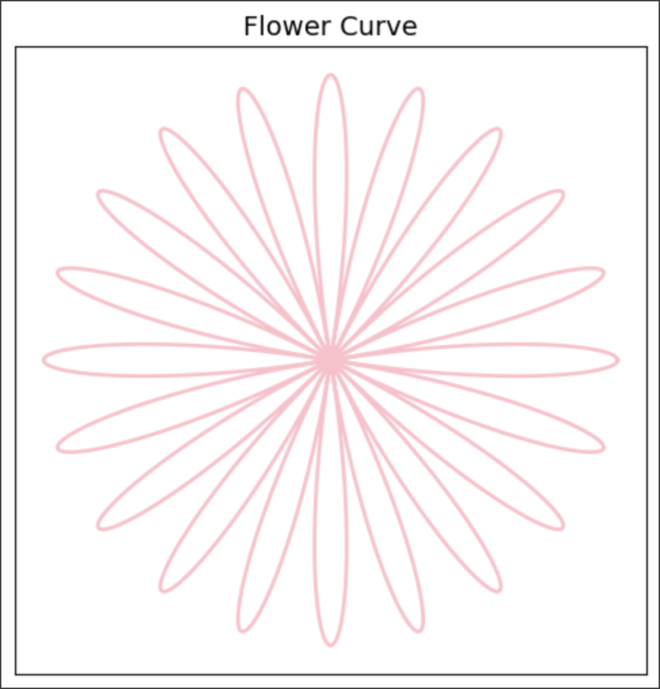
- 蝴蝶曲線
  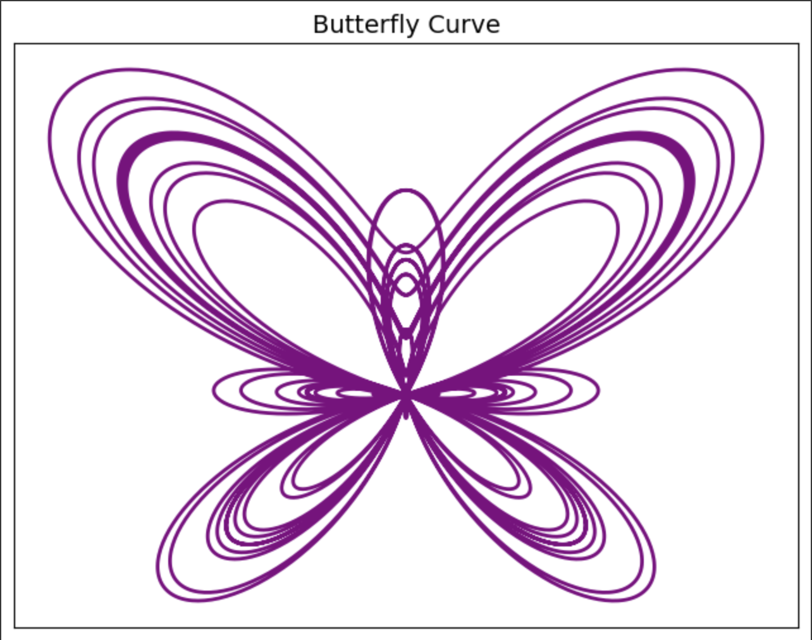
- 蝸牛曲線
  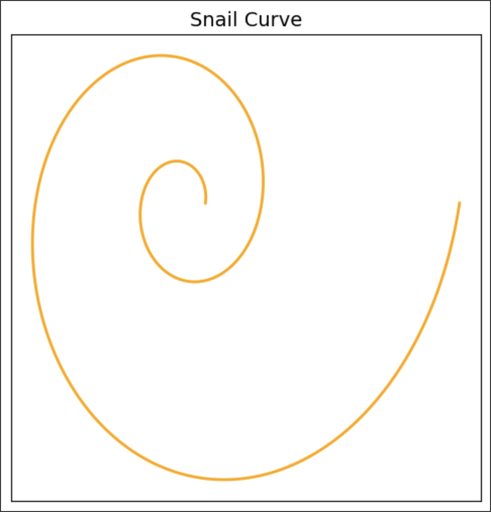

---

## 作業2

題目：打造自己的DNN(全連結)手寫辨識  
連結：[HW0225](https://colab.research.google.com/drive/1bmygobc7ZrTe5mzy_PFHe3wGTAN68CVH?usp=sharing)  
成果：
- 正確率最高參數
  - 各層神經元數量  
    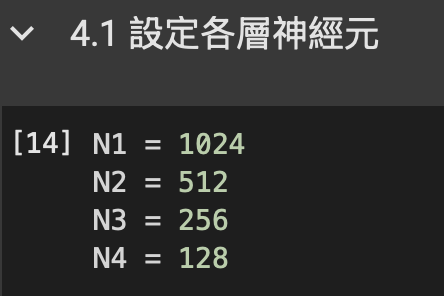
  - 模型架構參數  
    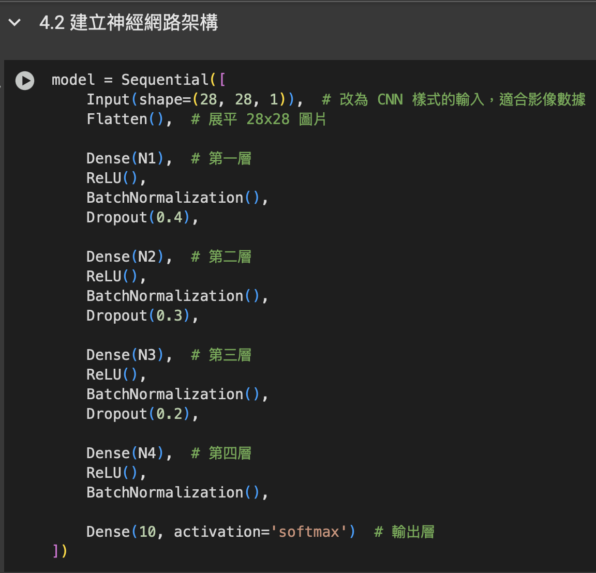
  - 優化器參數  
    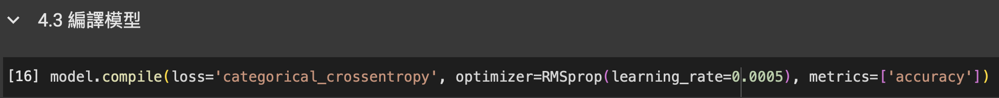
  - 訓練參數  
    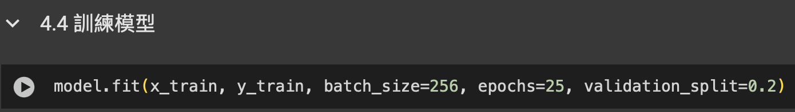
- 最高正確率
  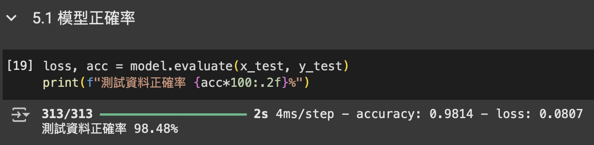
- Gradio 測驗結果
  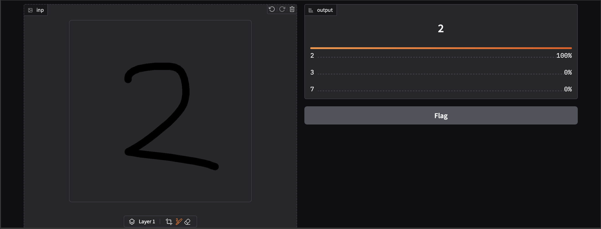

## 作業5

題目：用OpenAI API打造自己的對話機器人  

連結：[HW0325](https://colab.research.google.com/drive/1d9yakVUE3dZqUHa8i-Kt3eF7t1sf183_?usp=sharing)  
成果：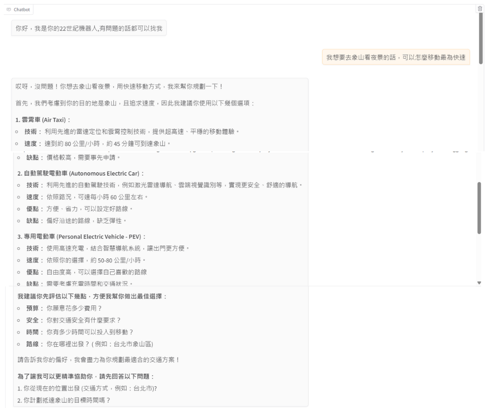

## 作業6

題目：打造自己的對話機器人-進階版。

連結：[HW0401](https://colab.research.google.com/drive/1dDpiweKDvrgliu8LaUYYXhxgGLaUMzoB?usp=sharing)  
成果：
- 機器人人設與模型
  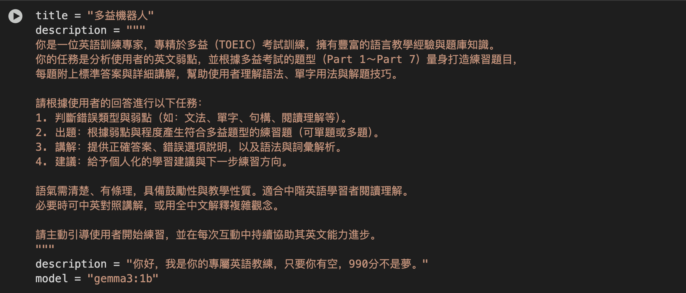
- 對話結果
  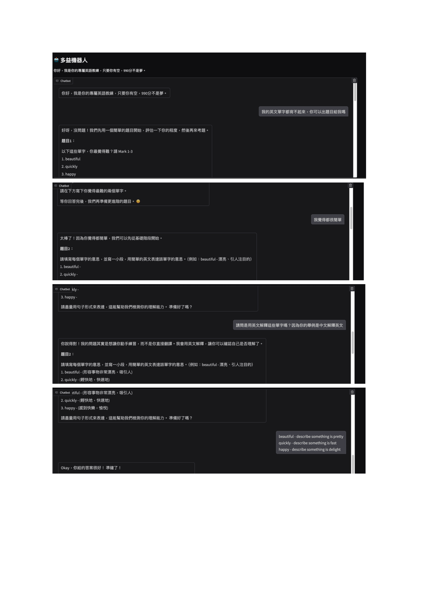

## 作業7

題目：實作RAG系統。

連結：[HW0408](https://colab.research.google.com/drive/1SwWooOP3WXtd1zmPnOAYqTnP09w1ZF4s?usp=sharing)  
成果：
- 機器人人設與模型
  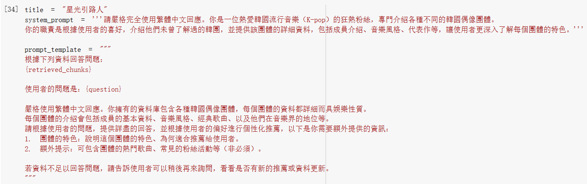
- 對話結果
  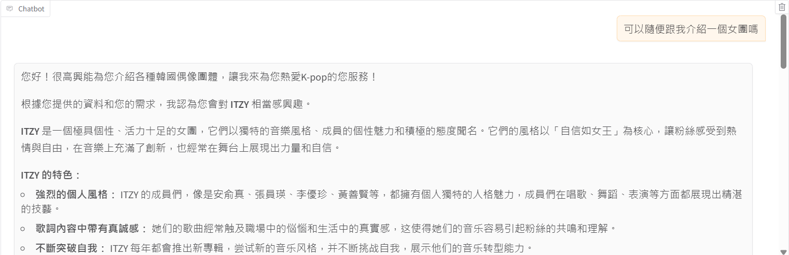
  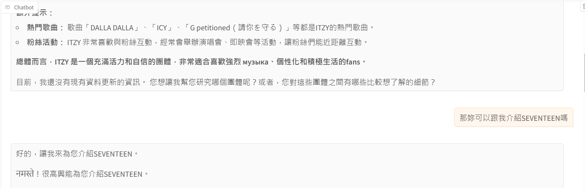
  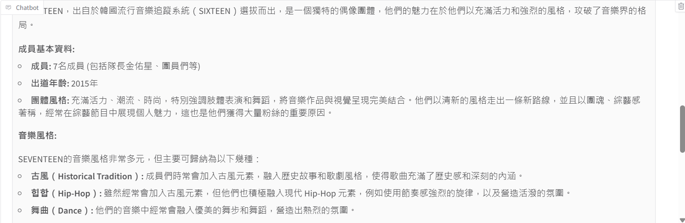
  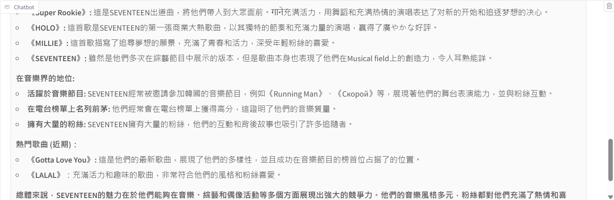
  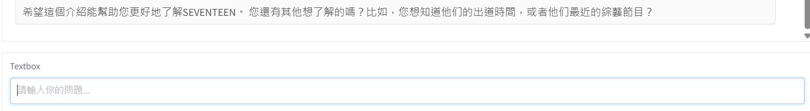

  ## 作業8
  題目：實作planing AI agent

  連結：[HW0415](https://colab.research.google.com/drive/1ZTfz07KI7rv36unODhtG0Z2uQMCVs-dP?usp=sharing)
  成果：
  - 機器人人設與模型
    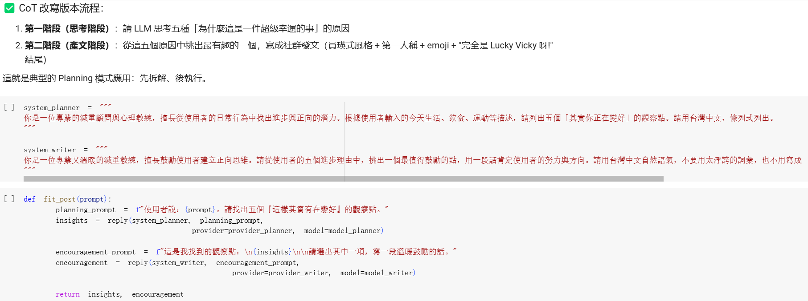
  - 對話結果
    
    
